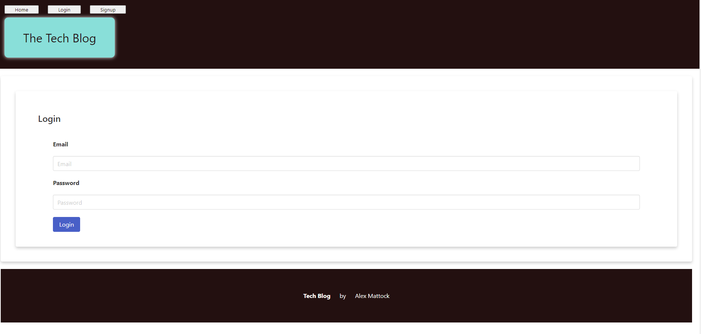
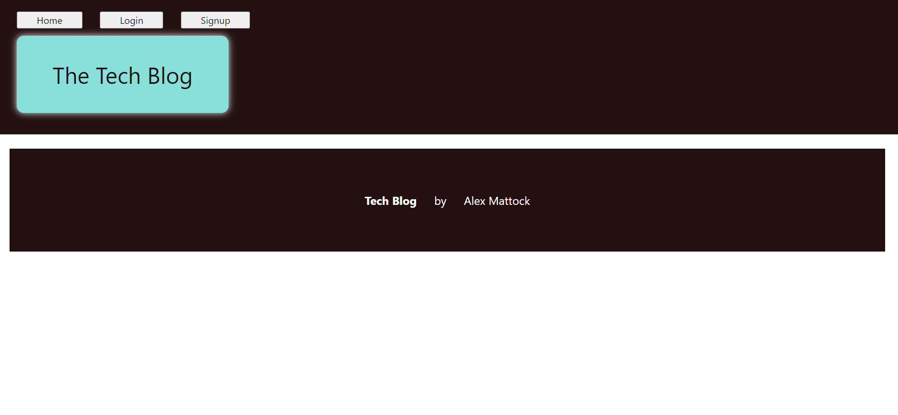

# Tech-post
A CMS style post page using the MVC paradigm in its architectural structure, using Handlebars.js as the templating language, "Sequelize" as the ORM, and the express-session "npm" package for authentication.

This is still a work in progress, the signup and posts are not working yet, but the login is working and the dashboard is working as well.

Deployed app link: https://alexscooltechblog-0464e5506955.herokuapp.com

## Table of Contents
* [Installation](#installation)
* [description](#description)
* [screenshots](#screenshots)
* [Credits](#credits)
* [License](#license)

## Installation
to install this project, clone the repository and run `npm install` to install all dependencies. Then run `npm seeds` to seed the database. Then run `npm start` to start the server.

## Description
This project is a CMS style blog site where developers can publish their blog posts and comment on other developers’ posts as well. This site is built using the MVC paradigm in its architectural structure, using Handlebars.js as the templating language, "Sequelize" as the ORM, and the express-session "npm" package for authentication.

## Screenshots

## Credits
help with routes folder was used from this author: https://users.rust-lang.org/t/handlebars-does-not-include-css/67027
help with the models folder was used from this author: https://stackoverflow.com/questions/66610163/sequelize-associations-are-not-working
help with mysql db creation was used from this page: https://dev.mysql.com/doc/refman/8.0/en/creating-database.html & https://dev.mysql.com/doc/mysql-getting-started/en/#mysql-getting-started-installing.

## License
MIT License

Copyright (c) 2023 amattock

Permission is hereby granted, free of charge, to any person obtaining a copy of this software and associated documentation files (the "Software"), to deal in the Software without restriction, including without limitation the rights to use, copy, modify, merge, publish, distribute, sublicense, and/or sell copies of the Software, and to permit persons to whom the Software is furnished to do so, subject to the following conditions:

The above copyright notice and this permission notice shall be included in all copies or substantial portions of the Software.

THE SOFTWARE IS PROVIDED "AS IS", WITHOUT WARRANTY OF ANY KIND, EXPRESS OR IMPLIED, INCLUDING BUT NOT LIMITED TO THE WARRANTIES OF MERCHANTABILITY, FITNESS FOR A PARTICULAR PURPOSE AND NONINFRINGEMENT. IN NO EVENT SHALL THE AUTHORS OR COPYRIGHT HOLDERS BE LIABLE FOR ANY CLAIM, DAMAGES OR OTHER LIABILITY, WHETHER IN AN ACTION OF CONTRACT, TORT OR OTHERWISE, ARISING FROM, OUT OF OR IN CONNECTION WITH THE SOFTWARE OR THE USE OR OTHER DEALINGS IN THE SOFTWARE.